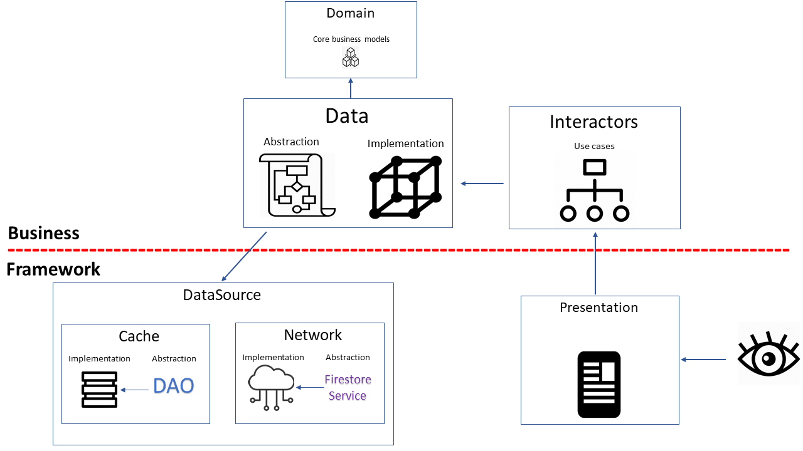

## MVI Note App
### Developed by Mahdi Razzaghi Ghaleh

#### What are these Use Cases/interactors supposed to do?

#### Do We really need  Use Cases?
Answer is in my source




**Presentation**: Responsible for showing information to the user and interpreting user commands;
**Application**: Defines the jobs the software is supposed to do by orchestrating the data flow from and to the domain models;
**Domain**: Represents concepts of the business, information about the current situation and business rules;
**Data**: Responsible for persisting domain models.


#### Layered Architectures and the Application Layer
In order to understand Use Cases we first need to understand Layered Architectures and the Application Layer

There are different ways a software system can be divided but after years of experimentation the industry converged on using few standard layers:
**Presentation**: Responsible for showing information to the user and interpreting user commands;
**Application**: Defines the jobs the software is supposed to do by orchestrating the data flow from and to the domain models;
**Domain**: Represents concepts of the business, information about the current situation and business rules;
**Data**: Responsible for persisting domain models.


## NOTE:
**1)** so in interactors package we build our Use-cases for each action such like insertNewNote.SearchNewNote,DeleteNote and... 

### **2)Use-Cases**: 
Every use case has a StateEvent pass to it,because the stateEvent falls away pass throw,then when StateEvent is complete it will return. 


### **2)StateEvent**: 

```kotlin
    class InsertNewNoteEvent(
        val title: String
    ): NoteListStateEvent() {

        override fun errorInfo(): String {
            return "Error inserting new note."
        }

        override fun eventName(): String {/**we can manage State-Event by eventName*/
            return "InsertNewNoteEvent"
        }

        override fun shouldDisplayProgressBar() = true/**in some cases we maybe need to show progressBar*/
    }
   ```
```kotlin
    
interface StateEvent {/**this interface has some properties which every StateEvent should have it*/

    fun errorInfo(): String

    fun eventName(): String

    fun shouldDisplayProgressBar(): Boolean
}
   ```
    
    
### **2)ViewState**: 

```kotlin
    /**viewState defines every variable that can be used in that View(fragment)*/
@Parcelize  /**because we gonna save it in bundle*/
data class NoteListViewState(
    var noteList: ArrayList<Note>? = null,
    var newNote: Note? = null, 
    var notePendingDelete: NotePendingDelete? = null, 
    var searchQuery: String? = null,
    var page: Int? = null,
    var isQueryExhausted: Boolean? = null,
    var filter: String? = null,
    var order: String? = null,
    var layoutManagerState: Parcelable? = null,
    var numNotesInCache: Int? = null
) : Parcelable, ViewState 
   ```


### Some Ideas:
Reference: https://medium.com/@douglas.iacovelli/how-to-handle-errors-with-retrofit-and-coroutines-33e7492a912


